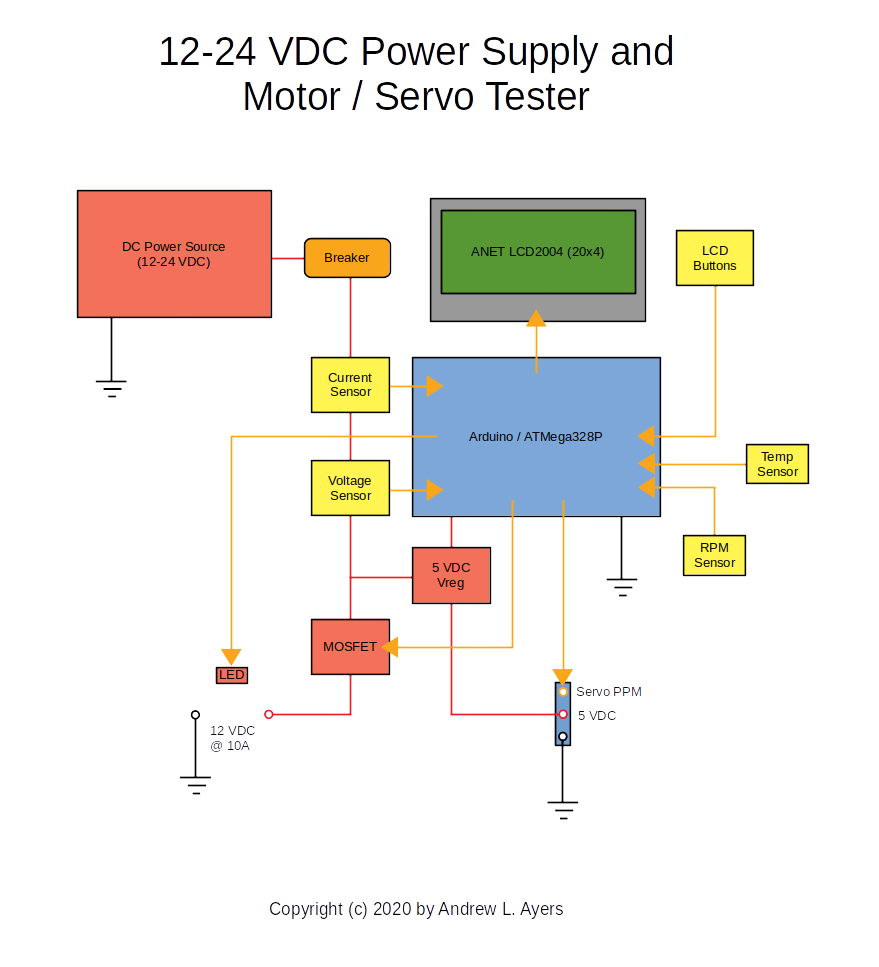

# 12-24 VDC Motor and Servo Tester #

### Block Diagram ###

### Description ###

This project details the design and construction of a piece of testing equipment for:

* Testing of brushed and brushless DC motors
* Monitoring of motor current usage, RPM, and temperature
* Testing of standard hobby RC servos and ESCs (electronic speed controllers)

Standard capabilities will include:

* LCD-based menu and button operation/configuration
* Enclosed in a plastic dust-proof ammo box for portability
* 12-24 volt DC operation via external power supply
* Regulated voltage for servo and ESC operation
* Automatic voltage detection for calculations
* Automatic shutdown based on fault presets
* Manual e-stop

Additional planned capabilities include:

* Pass-thru DC power supply monitoring and logging
* Optional menu-based control via USB serial
* Optional data logging via USB serial or to an SD card
* (blue-sky) Bluetooth control and logging via mobile application?

### Why am I building this? ###

The need for this piece of equipment arose when I realized I had quite a few different DC motors and servos that I had little idea as to their actual capabilities. Questions arose such as:

* Can I run a particular motor continuously?
* At what RPM does this motor rotate for a given voltage?
* Does a given motor heat up appreciably under load?
* How much current does the motor use?

These and other questions I knew could be answered using a variety of manual methods and tools, and I initially looked into combining a simple power supply with a BEC (battery elimnator) to power a servo tester, along with current and voltage meters.

With thought, I realized that I really wanted to know these measurements over time, and logging the data for graphing purposes, and more. Once I settled on what I really wanted and needed, it became apparent that a microcontroller should be involved, and an Arduino fit the bill perfectly.

I realized that in order to control the motors, I could use PWM to control the speed, but what about using a hobby ESC instead? Of course, I could then monitor and test such ESCs - and I could also add some simple servo testing capability...

Of course, right now this is all still a "plan" - more in my head than anywhere else. Some of it is written down, but not really everything is completely planned out. I still need to do some experiments, breaking down the project into units that can then be brought together into a whole:

* LCD control and button monitoring
* Menu display and configuration
* Monitoring of various sensors (voltage, current, RPM, temperature)
* Control of the motor voltage (PWM), servos, and ESC
* Integrating e-stop capability
* ...and probably a bunch of other things I'm forgetting

More than anything, I want to have some fun with this project as I build it, and come up with a functionally useful device to be proud of, and hopefully inspire others with.

### Project Folder Structure ###

The project will likely have a variety of folders for:

* Plans and drawings
* Photos of work
* Documents for ideas and planning
* Code - Arduino sketches and libraries (as needed)

These will be put in place as needed...

### Additional References ###

* [LCD Menu Operations](menu/menu-operations.md)
* [ANET LCD2004 Pinout Reference](lcd2004/LCD2004-pinout.md)
* [Arduino Pin Usage Reference](general/pins.md)

### Pull Requests ###

If you wish to make a pull request against this repo, go for it, just know that any such request may or may not be used...

### Licenses ###

Unless otherwise specified:

* All code and hardware is Copyright (c) 2020 by Andrew L. Ayers
* All code is licensed as GPLv3 (http://www.gnu.org/licenses/gpl-3.0.en.html)
* All hardware is licensed as CC-BY-NC-SA-4.0 (http://creativecommons.org/licenses/by-nc-sa/4.0/)

Please see the `LICENSES.md` file for more information.

### Disclaimer ###

No guarantees are made or should be implied that any of the work presented will be fit for any particular use, compile properly, or work correctly. I take no responsibility for your use or misuse of my designs, content, or code. Caveat emptor!

### Who do I cuss out? ###

If you notice any discrepancies or issues with this project, or if you just want to send me a love letter (or hate mail):

* Andrew L. Ayers - andrewa AT phoenixgarage DOT org [ [www.phoenixgarage.org](https://www.phoenixgarage.org/) ]