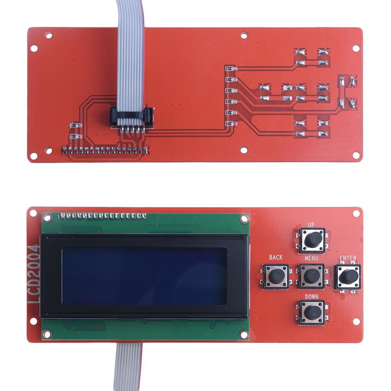
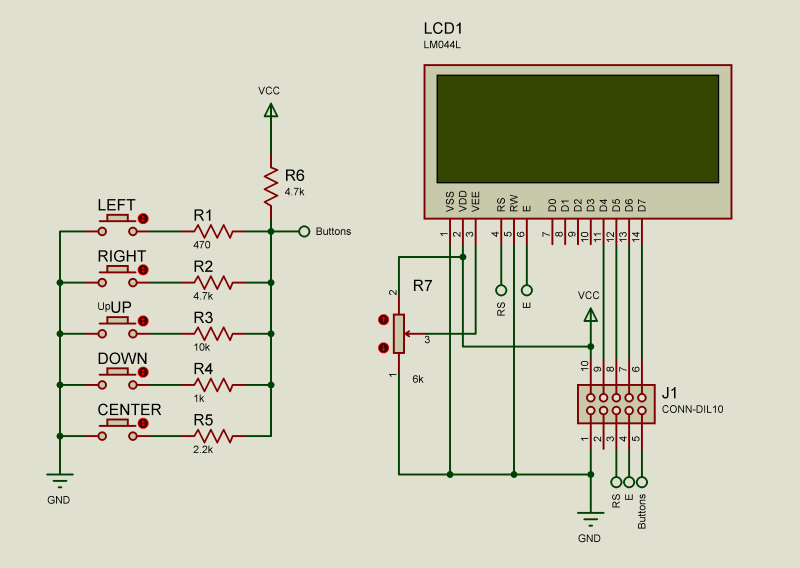

# ANET LCD2004 and Buttons - Module, Schematic, and Pinouts #

## Module ##



## Schematic ##



## Board (back) Pinouts ##

### LCD Pin Order ###

[ 16 . . . . . . . 8 . . . . . . 1 ]

### IDC Male Connector ###

  * Pin 1 (Bottom Left)
  * Pin 5 (Bottom Right)
  * Pin 6 (Top Right)
  * Pin 10 (Top Left)
``` 
+-----------------+ 
| 10  9  8  7  6  |
|  1  2  3  4  5  |
+------+   +------+ 

IDC Male Connector Pin

 1 = Ground     (LCD Pin 1 and 16 - VSS, and Buttons)
 2 = NC
 3 = RS         (LCD Pin 4)
 4 = E          (LCD Pin 6)
 5 = Buttons
 6 = D7         (LCD Pin 14)
 7 = D6         (LCD Pin 13)
 8 = D5         (LCD Pin 12)
 9 = D4         (LCD Pin 11)
10 = VCC        (LCD Pin 2 - VDD, and Buttons)
```

### IDC Female Connector (Ribbon) ###

  * Pin 1 (Bottom Right)
  * Pin 5 (Bottom Left)
  * Pin 6 (Top Left)
  * Pin 10 (Top Right)

```
+-----------------+
|  6  7  8  9  10 |
|  5  4  3  2  1  |
+------+   +------+
       +---+

 1 = Ground     (LCD Pin 1 and 16 - VSS, and Buttons)
 2 = NC
 3 = RS         (LCD Pin 4)
 4 = E          (LCD Pin 6)
 5 = Buttons
 6 = D7         (LCD Pin 14)
 7 = D6         (LCD Pin 13)
 8 = D5         (LCD Pin 12)
 9 = D4         (LCD Pin 11)
10 = VCC        (LCD Pin 2 - VDD, and Buttons)
```

### Additional References ###

[Arduino Pin Usage Reference](../general/pins.md)

### Who do I cuss out? ###

If you notice any discrepancies or issues with this project, or if you just want to send me a love letter (or hate mail):

* Andrew L. Ayers - andrewa AT phoenixgarage DOT org [ [www.phoenixgarage.org](https://www.phoenixgarage.org/) ]